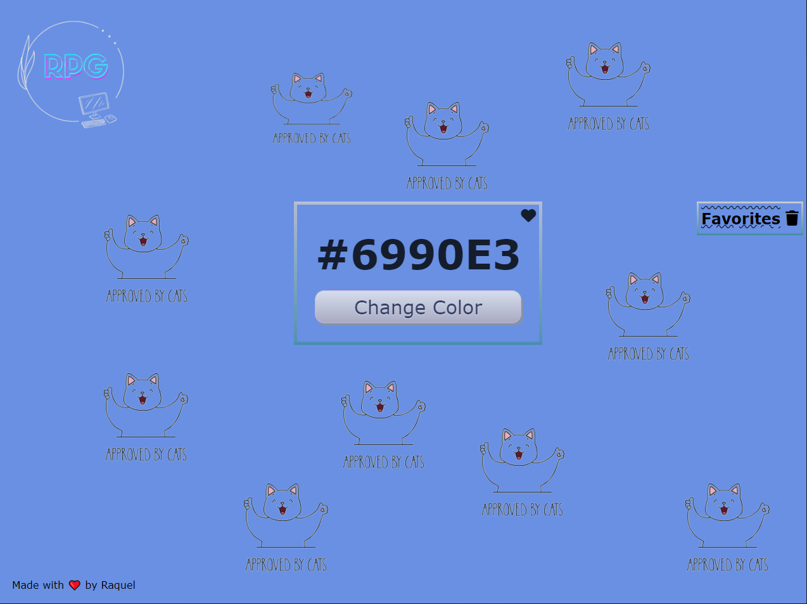
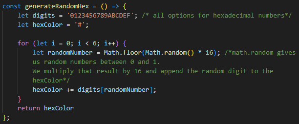
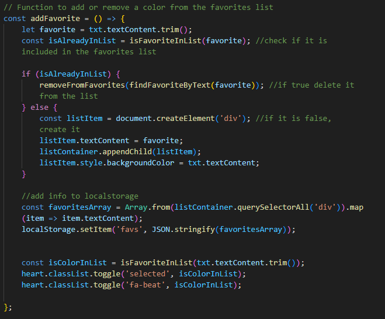
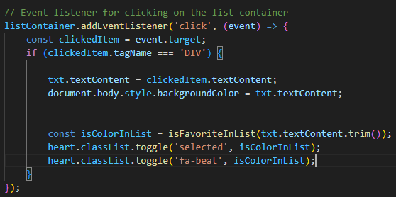

# Color Picker by [Raquel Peña](https://www.linkedin.com/in/raquel-pe-go/)

## ┐('～`;)┌ Stuck and don't know which color to choose?

Don't spend your money on those expensive color selectors <small> (I know there are free ones, but they're not as cool as mine)</small>. Choose the option that will conquer your heart, choose [Color Picker](https://rpg87.github.io/color-picker/)

 
 Approved ten times by cats (click me) 
 

## (〜￣ ▽ ￣)〜 Key Highlights 〜(￣ ▽ ￣〜)

- **Dynamic Color Generation**: Experience a new random color each time you click the button.

- **Favorite Colors**: Love a color? Simply click the heart icon to add it to your favorites. Changed your mind? Just click the heart again to remove it.

- **Favorites List**: Easily retrieve your favorite colors by clicking on them in the favorites list.

- **Local Storage**: Your favorite color list is stored in your local storage for easy access and persistence.

- **Quick Deletion**: Want to clear your entire list? A simple click on the trash icon does the job.

## (^=◕ᴥ◕=^) Demo

  

## \_\_φ(．．) Examples of code snippets

  
Dynamic Color Generation 

  
AddFavorites : Allows you to add, delete and manage the status of the heart icon, as well as save it to Local Storage.  

  
EventListener to retrieve the background color, number and status of the heart icon   

## (´• ω •`)ﾉ Quick Start

**Clone the Repository:**
git clone https://github.com/Rpg87/color-picker.git and open yout project

That's it! You're ready to roll. <spam style="color:DarkOrange" >H</spam><spam style="color:DarkOliveGreen">a</spam><spam style="color:Khaki">p</spam><spam style="color:Maroon">p</spam><spam style="color:LightSteelBlue">y</spam> <spam style="color:RoyalBlue">C</spam><spam style="color:MediumOrchid">o</spam><spam style="color:Salmon">d</spam><spam style="color:Teal">d</spam><spam style="color:YellowGreen">i</spam><spam style="color:DodgerBlue">n</spam><spam style="color:DeepPink">g</spam>

## ฅ(^◕ᴥ◕^)ฅ Who is Raquel

I am Raquel, I consider myself a person with a great sense of humor, always eager to learn, a lover of challenges and this combination is what led me to study web development.

If you want to know more about me or if you have a fun project and you need help we could work together, you can find me [here](https://www.linkedin.com/in/raquel-pe-go/)

---

Thank you for reading my repository. 

 

 Be happy.

